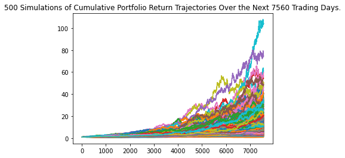
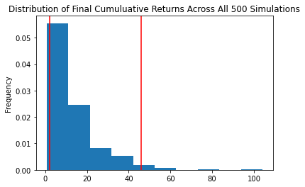
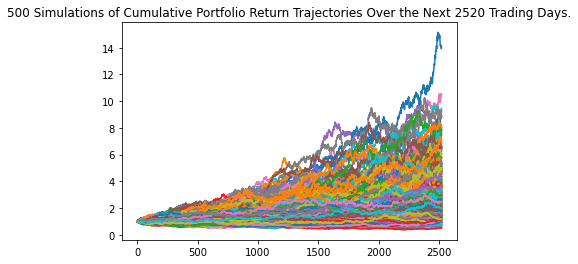
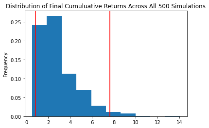

# 30/10-Year Forecast of Financial Plan Prototype Application

This Jupyter notebook is meant to be a prototype application that should help members of a credit union evaluate their financial health by being able to assess their monthly budgets and forecast an effective retirement plan based on their current holdings of cryptocurrencies, stocks, and bonds. It displays parts of the facts of a members savings, and from that the member is able to see if they're able to have an emergency fund in the account, as well as simulations ran to see how the future of their portfolio will do.

---

## Technologies

### Dependencies:
* `%matplotlib inline`

### Libraries:
* Pandas
* OS
* Requests
* JSON
* python-dotenv (dotenv)
* Alpaca SDK (alpaca_trade_api)
* MCForecastTools

The language of this application is Python on the Anaconda developement environment, used on Jupyter Lab. The only dependency used is `%matplotlib inline`. The libraries used that come with Python are Pandas, and OS. Requests, and JSON aren't under Python's standard utility models but come with Anaconda. Not one of the Alpaca SDK, python-dotenv, nor MCForecastTools libraries come with Python or Anaconda.

---

## Installation Guide

To install python-dotenv, enter `pip install python-dotenv` into your terminal. To install the Alpaca SDK, enter `pip install alpaca-trade-api` into your terminal. To access the MCForecastTools library, you must have the MCForecastTools.py or one like it in the starter code.

---

## Usage

#### Examples of forcast charts for a member's portfolio thirty years into the future:

#### and ten years into the future:

All info is already input and worked on within the Jupyter file. Simply start from the top and go down the page to view relevant data, calculations, analysis, and notes. Most notes are written as Markdown text.

---

## Contributor

Isaiah T Tensae